## Building-segmentation
-
1. Train Dataset (1024*1024)
- train image와, encode된 csv 파일

<figure>
    - image  
    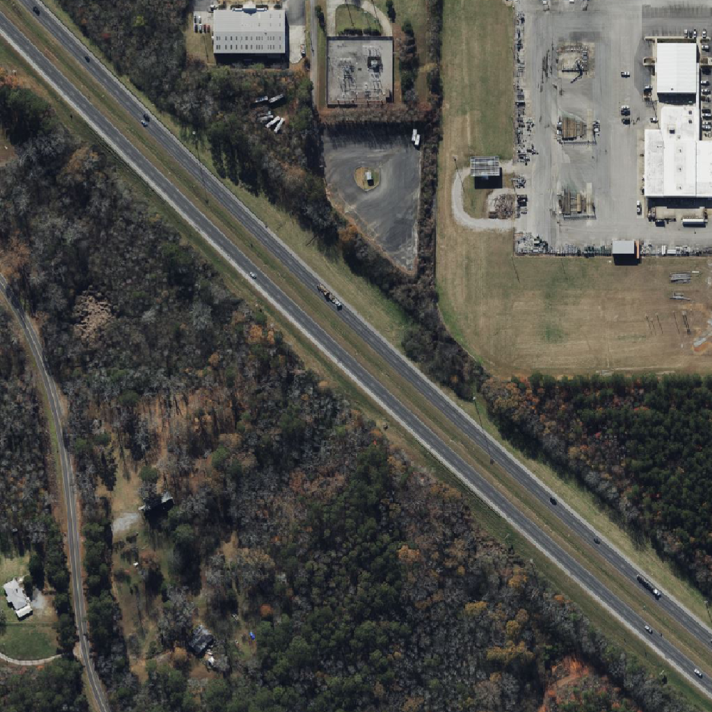  
    - mask   data = pd.read_csv("./extra/train.csv"), data.iloc[0,2]
</figure>

<figure>
    - image  
    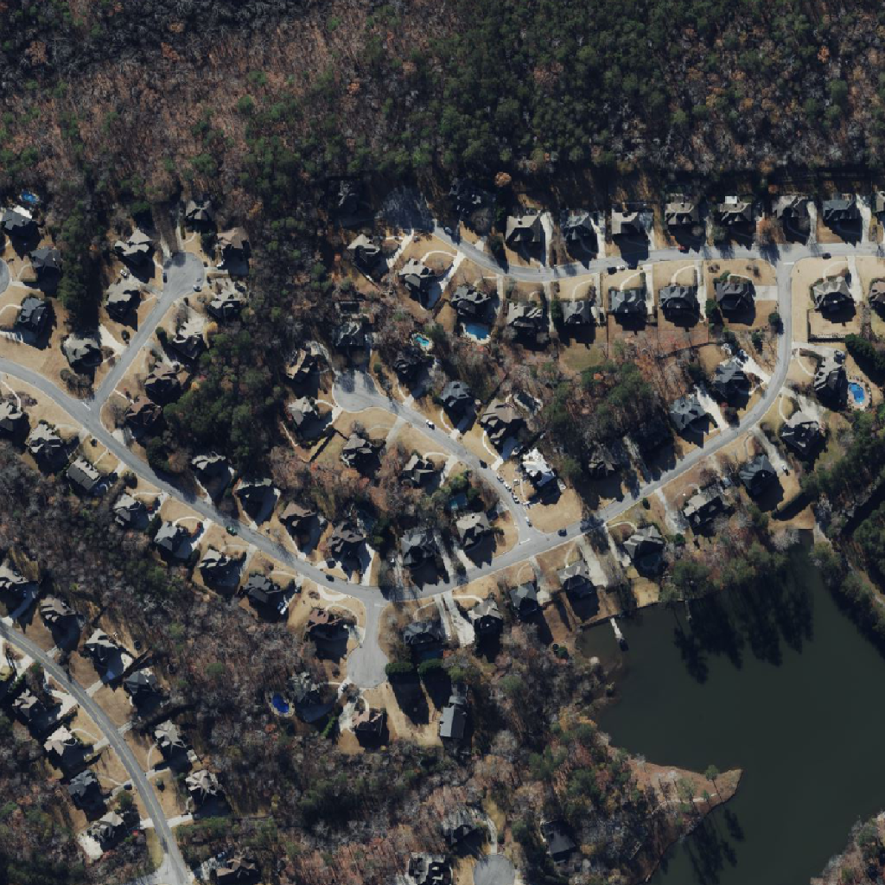  
    - mask   data = pd.read_csv("./extra/train.csv"), data.iloc[1,2]
</figure>

<figure>
    - image  
    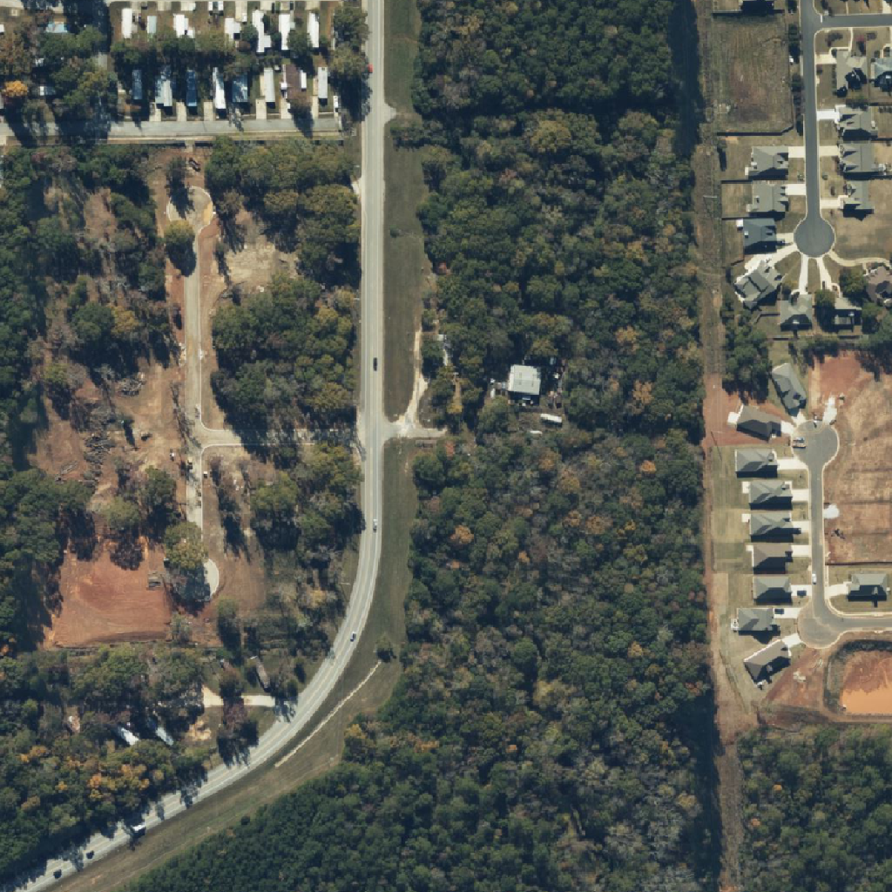  
    - mask   data = pd.read_csv("./extra/train.csv"), data.iloc[2,2]
</figure>

<figure>
    - image  
    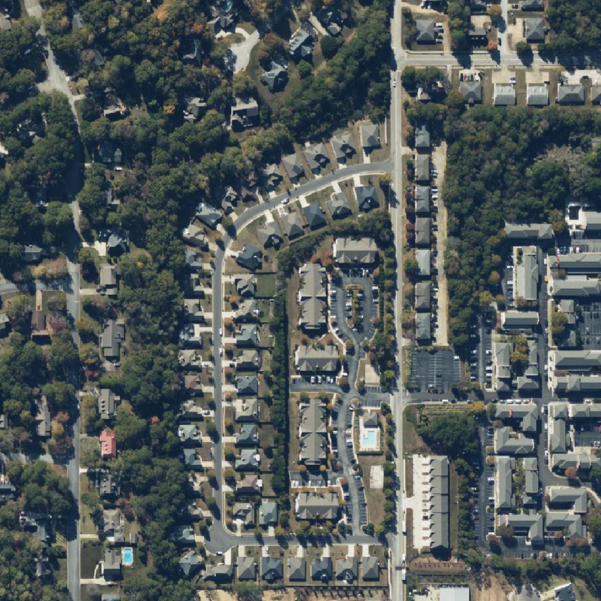  
    - mask   data = pd.read_csv("./extra/train.csv"), data.iloc[3,2]
</figure>

2. Test Dataset (224*224)
- test image
<figure>
    - image  
    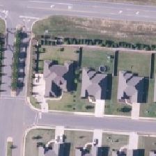  
</figure>

<figure>
    - image  
    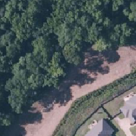  
</figure>

<figure>
    - image  
    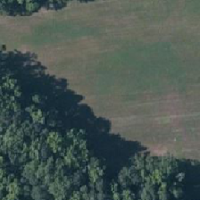  
</figure>

<figure>
    - image  
    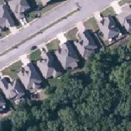  
</figure>

3. 처음 도전한 Library와 모델
- segmentation_models.pytorch
    - [SMP 모델 GITHUB 주소](https://github.com/qubvel/segmentation_models.pytorch)
- FPN
    - [FPN 논문](https://arxiv.org/pdf/1612.03144.pdf) 
---
- 해당 Library와 모델로 parameter를 적절히 조절한 결과
<figure>
    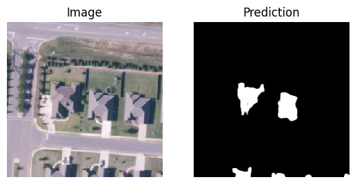  
</figure>

<figure>
    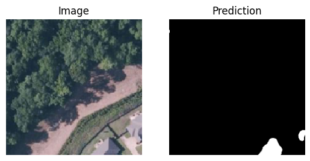  
</figure>

<figure>
    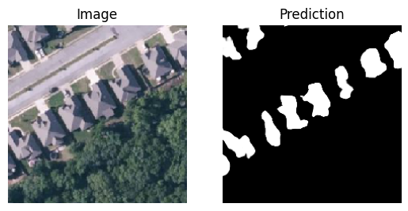  
</figure>

- 성능이 좋지 않은 것을 확인

4. 두 번째 도전한 Library와 모델
- mmsegmentation
    - [mmsegmentation GITHUB 주소](https://github.com/open-mmlab/mmsegmentation)
- Segformer
    - [Segformer 논문](https://arxiv.org/pdf/2105.15203.pdf) 
---
- 해당 Library와 모델로 parameter를 적절히 조절한 결과

<figure>
    - 검증 set으로 분류해둔 train image는 잘 분류한 것을 알 수 있음   
    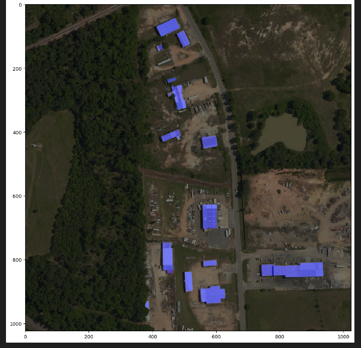  
</figure>

<figure>
    - test image는 mask의 경계가 불분명하다
    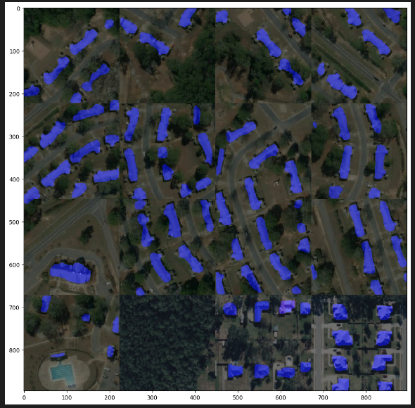  
</figure>

<figure>
    - test image는 건물이 아닌 곳을 건물이라고 인식한 부분도 존재한다.
      
</figure>

5. 이에 대해 생각한 해결 방안
- 그림자가 진 부분을 건물로 인식하는 것 같음
    - 이를 위해 CLAHE Augmentation 기법을 사용해야 한다고 생각함
- 크기가 달라지면 건물을 인식하기 어려워하는 것 같음
    - 이를 위해 ZOOM, CROP과 같은 Augmentation 기법을 사용해야 한다고 생각함
- 경계를 명확하게 구분하기 어려워 하는 것 같음
    - Binary Cross Entropy나 BceWithLogitsLoss와 같은 다양한 loss를 적용하거나 loss를 융합하는 Hybrid loss를 적용해봐야 함

6. Summary Model
<figure>
    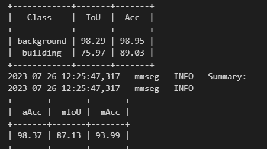  
</figure>

 